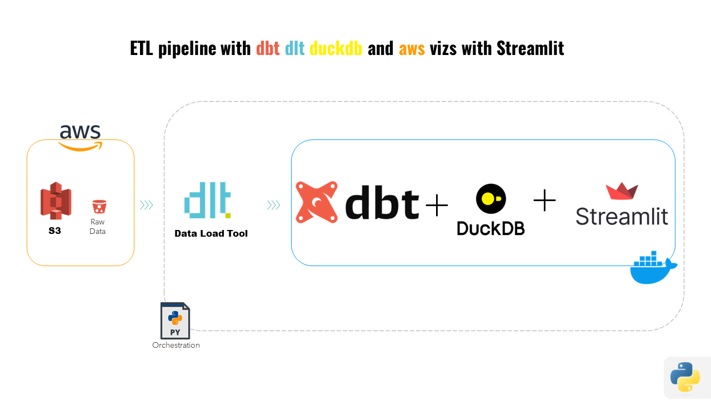

# Proyecto ETL de Comercio Exterior con DLT, DBT, DUCKDB y AWS

### Este proyecto implementa un pipeline ETL utilizando dlt (Data load tool), dbt (Data Build Tool) con DuckDB y AWS S3.
### El objetivo es procesar y transformar datos de comercio exterior de España almacenados en archivos CSV en S3 en un modelo dimensional con tablas de hechos y dimensiones.




## Estructura del Proyecto
```
ETL-dbt-dlt-aws/
├── docker-compose.yml
├── Dockerfile
├── Assets
├── dbt_project/
│   ├── comexdata/
│   │   ├── analyses/
│   │   ├── macros/
│   │   │   └── publish.sql
│   │   ├── models/
│   │   │   ├── 01staging/
│   │   │   │   ├── sgt_comex.sql
│   │   │   │   ├── sgt_paises.sql
│   │   │   │   ├── sgt_provincias.sql
│   │   │   │   └── sgt_taric.sql
│   │   │   ├── 02cleaned/
│   │   │   │   └── cleaned_comex.sql
│   │   │   ├── 03enriched/
│   │   │   │   └── enriched_comex.sql
│   │   │   ├── 04structural/
│   │   │   │   └── formatted_comex.sql
│   │   │   ├── 05datamart/
│   │   │   │   ├── dim_paises.sql
│   │   │   │   ├── dim_provincias.sql
│   │   │   │   ├── dim_taric.sql
│   │   │   │   └── fact_comex.sql
│   │   │   ├── 06analysis/
│   │   │   │   ├── trade_by_country_product.sql
│   │   │   │   └── trends_by_month_year.sql
│   │   │   └── schema.yml
│   │   ├── seeds/
│   │   └── tests/
│   ├── data/
│   │   └── bronze/
│   │       ├── datacomex/
│   │       │   ├── comex_taric/
│   │       │   │   └── [yearmonth]/
│   │       │   │       └── comex_taric_[yearmonth].csv
│   │       │   └── metadata/
│   │       │       ├── PAISES.csv
│   │       │       ├── PROVINCIAS.csv
│   │       │       └── SECTORES.csv
│   │       └── dlt_pipeline_info/
│   ├── logs/
│   ├── streamlit/
│   │   └── dashboard.py
│   ├── target/
│   ├── dbt_project.yml
│   ├── profiles.yml
│   └── packages.yml
├── dlt_scripts/
│   ├── fetch_comexdata_dlt.py
│   └── fetch_metadata_dlt.py
├── orchestration/
│   └── orchestrator.py
├── .env
├── .gitignore
├── requirements.txt
└── README.md

```

## Configuración del Entorno
### Requisitos Previos
- Docker Desktop
- Un bucket de AWS S3 con archivos CSV de comercio exterior o acceso al bucket configurado para el proyecto. Recomendable persistir en S3 los csv en UTF8 para evitar incompatibildiades.
- Credenciales de AWS (Access Key ID y Secret Access Key)
- Fuente original de los [datos](https://datacomex.comercio.es/Data/Descarga). Requiere registro gratuito para descarga masiva
  - Los datos son servidos en .zip. Los csv (UTF16, Tabulador como separador). 

## Instrucciones
1. **Construir la Imagen Docker**

```
docker-compose build
```
2. **Iniciar el Contenedor Docker**

```
docker-compose up -d
```
3. **Acceder al Contenedor**

```
docker exec -it dbt_demo /bin/bash
```

4. **Configurar Credenciales de AWS**

    Dentro del contenedor, configura tus credenciales de AWS:

root@4f3f143dce26:/dbt_project#
```
export AWS_ACCESS_KEY_ID="your-access-key-id"
export AWS_SECRET_ACCESS_KEY="your-secret-access-key"
```
5. **Ejecución manual de Pipelines DLT** (Existe orquestador. Leer al final)

En casos donde se necesite forzar la actualización o carga de datos específicos, los pipelines DLT pueden ser ejecutados manualmente. 
Los scripts están ubicados en el directorio dlt_scripts y pueden ser ejecutados como sigue:

Desde directorio raiz local
```
python dlt_scripts/fetch_comexdata_dlt.py
python dlt_scripts/fetch_metadata_dlt.py

```
Estos pipelines ingestarán los datos desde S3 hacia los directorios locales:

- ([csv](dbt_project/data/bronze/datacomex))
- ([pipeline_info](dbt_project/data/dlt_pipeline_info))

6. **Ejecutar dbt** (Existe orquestador. Leer al final)

root@4f3f143dce26:/dbt_project#
```
dbt run
```
Generará las tablas en duckdb a partir de los modelos dbt definidos.

## Flujo Lógico de dbt con DuckDB
1. **Modelos de Staging**

Modelos de staging preparan los datos para limpieza y transformaciones, leyendo los archivos desde AWS S3 y cargándolos en tablas duckdb.

2. **Modelos de Limpieza y Enriquecimiento**

Aplican transformaciones para limpiar y enriquecer los datos, preparándolos para análisis y reportes.

3. **Modelos Estructurales y de Datamart**

Crean las tablas de dimensiones y hechos, facilitando el análisis dimensional del comercio exterior.

4. **Modelos Analiticos**
Crean tablas con consultar concretas que extraen información valiosa del conjunto de datos y de utilidad para el dashboard.


## Acceder a DuckDB y Consultar las Tablas MANUALMENTE
1. **Acceder al Contenedor**

   Asegúrate de estar dentro del contenedor Docker en ejecución:

```
docker exec -it dbt_demo /bin/bash
```

2. **Iniciar DuckDB**

    Inicia el CLI de DuckDB con el archivo de base de datos generado:

```
duckdb /dbt_project/dev.duckdb
```

3. **Consultar las Tablas**

    Puedes ejecutar consultas SQL en las tablas creadas por dbt. Por ejemplo, para consultar las primeras 10 filas de la tabla dbt_blue.fact_comex:

```
SELECT * FROM dbt_blue.fact_comex LIMIT 10;
````


También puedes explorar otras tablas como dim_paises y dim_taric:

```
SHOW TABLES;
SELECT * FROM dbt_blue.dim_paises LIMIT 10;
SELECT * FROM dbt_blue.dim_taric LIMIT 10;
```
## Pruebas (Tests) con DBT MANUALMENTE
   Para implementar y ejecutar pruebas en DBT, seguimos los siguientes pasos:
   
1. **Definir Pruebas en schema.yml:**

   En el archivo schema.yml definimos pruebas genéricas y unitarias como unique y not_null para nuestras tablas y columnas. También se han implementado test con dbt_expectations

2. **Ejecutar las Pruebas:**

   Ejecutamos las pruebas definidas en schema.yml utilizando el siguiente comando:

```
dbt test
```
Esto ejecutará todas las pruebas definidas y mostrará los resultados en la consola. Si todas las pruebas pasan, verás un resumen indicando que todas las pruebas se completaron con éxito.

3. **Agregar Pruebas con dbt-expectations:**

   Para agregar pruebas adicionales utilizando 'dbt-expectations', primero debemos agregar el paquete a nuestro proyecto en 'packages.yml':

```
packages:
  - package: calogica/dbt_expectations
    version: 0.8.0

```
   Luego, actualizamos el archivo dbt_project.yml para incluir las variables necesarias:
```
vars:
  'dbt_expectations:time_zone': 'Europe/Madrid'
```
   Ejecutamos el comando para instalar el paquete:

```
dbt deps
```
   Finalmente, definimos las nuevas pruebas en 'schema.yml'

4. **Ejecutar las Nuevas Pruebas:**

   Volvemos a ejecutar las pruebas para verificar que todo esté en orden:

```
dbt test
```
## Uso de Streamlit para Visualización

1. **Instalar Streamlit y Matplotlib:**

   Primero, asegúrate de tener streamlit y matplotlib instalados en tu entorno.

```
pip install streamlit matplotlib
```

2. **Crear el Script de Streamlit:**

   Crea un archivo 'dashboard.py' dentro de un directorio streamlit/ en tu proyecto y añade el código adaptado a tu proyecto.

3. **Ejecutar Streamlit:**

   Para ejecutar Streamlit, usa el siguiente comando:

```
streamlit run streamlit/dashboard.py --server.port 8080
```
4. **Acceder a la Aplicación de Streamlit:**

   Abre tu navegador web y navega a http://localhost:8080 para ver la aplicación de Streamlit en acción.


## Orquestador

- Evalúa la existencia de archivos en local comparándolos con los existentes en S3.
- Si los archivos no están presentes localmente, ejecuta pipelines DLT para cargarlos.
- Posteriormente, procede con la ejecución de modelos dbt y test.
- Finalmente lanza la aplicación de Streamlit para visualización.

  Ejecutar Orquestador:
```
python orchestration/orchestrator.py
```

## Estrategia Write Audit Publish (WAP) con Entornos Blue y Green
En este proyecto se ha implementado una estrategia de Write Audit Publish (WAP) para asegurar la calidad y la consistencia de los datos a través de dos entornos distintos, denominados "blue" y "green".

### Configuración de Entornos
**Entorno Blue:** Este es el entorno inicial donde se cargan y transforman los datos. Aquí se ejecutan los modelos iniciales de dbt y se realizan las pruebas de calidad.

**Entorno Green:** Una vez que los datos han sido validados en el entorno blue, se replican en el entorno green. Este entorno actúa como la capa de producción donde los datos están listos para ser consumidos por los usuarios finales.

### Implementación del Macro publish
Para facilitar el traspaso de datos entre estos dos entornos, se ha desarrollado un macro dbt llamado publish, que automatiza el proceso de promoción de datos desde el entorno blue hacia el green. 
El macro verifica que el entorno objetivo sea green antes de ejecutar la replicación, asegurando que solo los datos validados y verificados sean movidos a producción.

ver ([macro](dbt_project/comexdata/macros/publish.sql)).

ver ([perfiles blue, greeen](dbt_project/profiles.yml)).

### Proceso de Actualización
**Ejecutar modelos en Blue:** Los datos se procesan y se validan en el entorno blue.
**Publicar en Green:** Usando el macro publish, los datos se promueven al entorno green una vez que pasan todas las pruebas de calidad y rendimiento.

La ejecución de 
```
dbt run
dbt test
```
carga por defecto el perfil blue.

La ejecución de
```
dbt run --profiles-dir . --target green --empty
```
para crear los esquemas en duckdb vacios o inicializarlos, seguido de 
```
dbt run-operation publish --profiles-dir . --target green
```
Publica la versión final de los datos blue en green.

**NOTA:** estos comandos pueden sustituirse en el orquestador, el cual, actualmente, ejecuta perfil blue.
